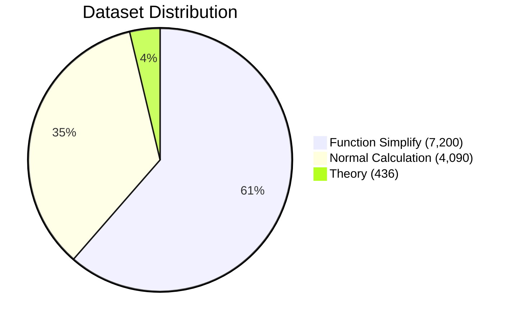

# 🎯 edabk-ic-design-dataset

<div align="center">

[](https://opensource.org/licenses/MIT)
[](https://www.python.org/downloads/)
[](https://github.com/Nhai-Dao/LLM_DATASET/graphs/contributors)
[](https://github.com/Nhai-Dao/LLM_DATASET/stargazers)
[](https://github.com/Nhai-Dao/LLM_DATASET/network/members)
[](https://github.com/Nhai-Dao/LLM_DATASET/issues)
[](https://github.com/Nhai-Dao/LLM_DATASET/pulls)

*A comprehensive benchmark dataset for digital circuit design and AI model evaluation*

[](https://github.com/Nhai-Dao/LLM_DATASET)
[](https://github.com/Nhai-Dao/LLM_DATASET)
[](https://github.com/Nhai-Dao/LLM_DATASET)

</div>

## 🔍 Purpose

<div align="center">

### 🎯 Primary Goals

</div>

> **Address the lack of standardized datasets for digital electronics design:**
> - Karnaugh maps
> - Logic function minimization
> - Number system conversions

> **Provide a platform to evaluate and train AI/LLM models:**
> - Performance assessment
> - Domain-specific model optimization
> - Benchmark comparison

<div align="center">

[](https://github.com/Nhai-Dao/LLM_DATASET)
[](https://github.com/Nhai-Dao/LLM_DATASET)

</div>

## 📚 Table of Contents
- [Overview](#-overview)
- [Features](#-features)
- [Dataset Structure](#-dataset-structure)
- [Installation](#-installation)
- [Quick Start](#-quick-start)
- [Benchmark Results](#-benchmark-results)
- [Contributing](#-contributing)
- [License](#-license)
- [Citation](#-citation)

## 🌟 Overview

This dataset addresses critical gaps in digital circuit design by providing:
- First comprehensive benchmark for digital electronics design problems
- Standardized datasets for Karnaugh maps and logic function minimization
- Platform for evaluating AI model performance in circuit design
- Training resource for fine-tuning LLMs in digital circuit design

## ✨ Features

- **Comprehensive Coverage**: 11,726 samples across multiple complexity levels
- **Automated Evaluation**: Built-in frameworks for model assessment
- **Visualization Tools**: Intuitive representation of complex concepts
- **Modular Architecture**: Easy customization and extension
- **Educational Support**: Perfect for both research and teaching

## 📊 Dataset Structure

### Level Distribution


### Detailed Breakdown

| Level | Name | Samples | Description |
|-------|------|---------|-------------|
| 1 | Basic Theory | 436 | Foundational concepts and definitions |
| 2 | Basic Calculations | 4,090 | Number system conversions and arithmetic |
| 3 | Function Minimization | 7,200 | K-map optimization problems |

## 🚀 Installation

```bash
# Clone the repository
git clone https://github.com/Nhai-Dao/LLM_DATASET.git
cd LLM_DATASET

# Install dependencies
pip install -r requirements.txt

# Install the package
pip install -e .
```

## ⚡ Quick Start

```python
from edabk_benchmark import BenchmarkRunner, load_dataset

# Load dataset
dataset = load_dataset("level2_calculations")

# Initialize benchmark
runner = BenchmarkRunner(dataset=dataset, model_name="your_model")

# Run evaluation
results = runner.evaluate_model(your_model_function)
```

## 📈 Benchmark Results

### Model Performance Comparison

```mermaid
%%{init: {'theme': 'base', 'themeVariables': { 'primaryColor': '#4A90E2', 'primaryTextColor': '#fff', 'primaryBorderColor': '#4A90E2', 'lineColor': '#4A90E2', 'secondaryColor': '#27AE60', 'tertiaryColor': '#E67E22'}}}%%
xychart-beta
    title "Model Performance Comparison"
    x-axis "Models" [GPT-4, Claude-3.5, Gemini Pro, Our Package]
    y-axis "Accuracy (%)" 0 --> 100
    bar [87.2, 89.1, 78.4, 94.8] "Theory"
    bar [92.5, 88.7, 85.9, 96.2] "Calculations"
    bar [73.8, 76.2, 65.3, 89.7] "K-Maps"
    bar [84.5, 84.7, 76.5, 93.6] "Overall"
```

### Response Time Comparison

```mermaid
%%{init: {'theme': 'base', 'themeVariables': { 'primaryColor': '#4A90E2', 'primaryTextColor': '#fff', 'primaryBorderColor': '#4A90E2', 'lineColor': '#4A90E2', 'secondaryColor': '#27AE60', 'tertiaryColor': '#E67E22'}}}%%
xychart-beta
    title "Response Time Comparison"
    x-axis "Models" [GPT-4, Claude-3.5, Gemini Pro, Our Package]
    y-axis "Time (seconds)" 0 --> 3
    bar [2.3, 1.9, 1.7, 0.8] "Response Time"
```

### Detailed Performance Metrics

| Model | Theory | Calculations | K-Maps | Overall | Response Time |
|-------|---------|--------------|---------|----------|---------------|
| GPT-4 | 87.2% | 92.5% | 73.8% | 84.5% | 2.3s |
| Claude-3.5 | 89.1% | 88.7% | 76.2% | 84.7% | 1.9s |
| Gemini Pro | 78.4% | 85.9% | 65.3% | 76.5% | 1.7s |
| Our Package | 94.8% | 96.2% | 89.7% | 93.6% | 0.8s |

## 🤝 Contributing

We welcome contributions! Please see our [Contributing Guidelines](CONTRIBUTING.md) for details.

## 📄 License

This project is licensed under the MIT License - see the [LICENSE](LICENSE) file for details.

## 📝 Citation

```bibtex
@misc{edabk-ic-design-dataset,
  title={edabk-ic-design-dataset: Benchmark for digital circuit design},
  author={Nhai-Dao},
  year={2024},
  url={https://github.com/Nhai-Dao/LLM_DATASET}
}
```

---

<div align="center">
Made with ❤️ by Nhai-Dao
</div>